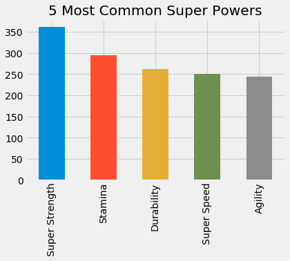

### Sample Question: Most Common Powers

The rest of this notebook will be left to you to investigate the dataset by formulating your own questions, and then seeking answers using pandas and numpy.  Every answer should include some sort of visualization, when appropriate. Before moving on to formulating your own questions, use the dataset to answer the following questions about superhero powers:

* What are the 5 most common powers overall?
* What are the 5 most common powers in the Marvel Universe?
* What are the 5 most common powers in the DC Universe?

## Step 1: Check the Data Types of all the columns in the dataframe


```python
heroes_and_powers_df.dtypes
```


    Agility                   object
    Accelerated Healing       object
    Lantern Power Ring        object
    Dimensional Awareness     object
    Cold Resistance           object
    Durability                object
    Stealth                   object
    Energy Absorption         object
    Flight                    object
    Danger Sense              object
    Underwater breathing      object
    Marksmanship              object
    Weapons Master            object
    Power Augmentation        object
    Animal Attributes         object
    Longevity                 object
    Intelligence              object
    Super Strength            object
    Cryokinesis               object
    Telepathy                 object
    Energy Armor              object
    Energy Blasts             object
    Duplication               object
    Size Changing             object
    Density Control           object
    Stamina                   object
    Astral Travel             object
    Audio Control             object
    Dexterity                 object
    Omnitrix                  object
                              ...   
    Matter Absorption         object
    The Force                 object
    Resurrection              object
    Terrakinesis              object
    Vision - Heat             object
    Vitakinesis               object
    Radar Sense               object
    Qwardian Power Ring       object
    Weather Control           object
    Vision - X-Ray            object
    Vision - Thermal          object
    Web Creation              object
    Reality Warping           object
    Odin Force                object
    Symbiote Costume          object
    Speed Force               object
    Phoenix Force             object
    Molecular Dissipation     object
    Vision - Cryo             object
    Omnipresent               object
    Omniscient                object
    Gender                    object
    Eye color                 object
    Race                      object
    Hair color                object
    Height                   float64
    Publisher                 object
    Skin color                object
    Alignment                 object
    Weight                   float64
    Length: 176, dtype: object


Will need to convert to True/False to 1 and 0 so that I can take sums of the columns

## Step 2: Convert True/False to 1/0


```python
heroes_and_powers_df.replace('True', 1, inplace = True)
heroes_and_powers_df.replace('False', 0, inplace = True)
```


```python
heroes_and_powers_df.head()
```


<div>
<style scoped>
    .dataframe tbody tr th:only-of-type {
        vertical-align: middle;
    }

    .dataframe tbody tr th {
        vertical-align: top;
    }

    .dataframe thead th {
        text-align: right;
    }
</style>
<table border="1" class="dataframe">
  <thead>
    <tr style="text-align: right;">
      <th></th>
      <th>Agility</th>
      <th>Accelerated Healing</th>
      <th>Lantern Power Ring</th>
      <th>Dimensional Awareness</th>
      <th>Cold Resistance</th>
      <th>Durability</th>
      <th>Stealth</th>
      <th>Energy Absorption</th>
      <th>Flight</th>
      <th>Danger Sense</th>
      <th>...</th>
      <th>Omniscient</th>
      <th>Gender</th>
      <th>Eye color</th>
      <th>Race</th>
      <th>Hair color</th>
      <th>Height</th>
      <th>Publisher</th>
      <th>Skin color</th>
      <th>Alignment</th>
      <th>Weight</th>
    </tr>
    <tr>
      <th>name</th>
      <th></th>
      <th></th>
      <th></th>
      <th></th>
      <th></th>
      <th></th>
      <th></th>
      <th></th>
      <th></th>
      <th></th>
      <th></th>
      <th></th>
      <th></th>
      <th></th>
      <th></th>
      <th></th>
      <th></th>
      <th></th>
      <th></th>
      <th></th>
      <th></th>
    </tr>
  </thead>
  <tbody>
    <tr>
      <th>A-Bomb</th>
      <td>0</td>
      <td>1</td>
      <td>0</td>
      <td>0</td>
      <td>0</td>
      <td>1</td>
      <td>0</td>
      <td>0</td>
      <td>0</td>
      <td>0</td>
      <td>...</td>
      <td>0</td>
      <td>Male</td>
      <td>yellow</td>
      <td>Human</td>
      <td>No Hair</td>
      <td>203.0</td>
      <td>Marvel Comics</td>
      <td>-</td>
      <td>good</td>
      <td>441.0</td>
    </tr>
    <tr>
      <th>Abe Sapien</th>
      <td>1</td>
      <td>1</td>
      <td>0</td>
      <td>0</td>
      <td>1</td>
      <td>1</td>
      <td>0</td>
      <td>0</td>
      <td>0</td>
      <td>0</td>
      <td>...</td>
      <td>0</td>
      <td>Male</td>
      <td>blue</td>
      <td>Icthyo Sapien</td>
      <td>No Hair</td>
      <td>191.0</td>
      <td>Dark Horse Comics</td>
      <td>blue</td>
      <td>good</td>
      <td>65.0</td>
    </tr>
    <tr>
      <th>Abin Sur</th>
      <td>0</td>
      <td>0</td>
      <td>1</td>
      <td>0</td>
      <td>0</td>
      <td>0</td>
      <td>0</td>
      <td>0</td>
      <td>0</td>
      <td>0</td>
      <td>...</td>
      <td>0</td>
      <td>Male</td>
      <td>blue</td>
      <td>Ungaran</td>
      <td>No Hair</td>
      <td>185.0</td>
      <td>DC Comics</td>
      <td>red</td>
      <td>good</td>
      <td>90.0</td>
    </tr>
    <tr>
      <th>Abomination</th>
      <td>0</td>
      <td>1</td>
      <td>0</td>
      <td>0</td>
      <td>0</td>
      <td>0</td>
      <td>0</td>
      <td>0</td>
      <td>0</td>
      <td>0</td>
      <td>...</td>
      <td>0</td>
      <td>Male</td>
      <td>green</td>
      <td>Human / Radiation</td>
      <td>No Hair</td>
      <td>203.0</td>
      <td>Marvel Comics</td>
      <td>-</td>
      <td>bad</td>
      <td>441.0</td>
    </tr>
    <tr>
      <th>Abraxas</th>
      <td>0</td>
      <td>0</td>
      <td>0</td>
      <td>1</td>
      <td>0</td>
      <td>0</td>
      <td>0</td>
      <td>0</td>
      <td>1</td>
      <td>0</td>
      <td>...</td>
      <td>0</td>
      <td>Male</td>
      <td>blue</td>
      <td>Cosmic Entity</td>
      <td>Black</td>
      <td>-99.0</td>
      <td>Marvel Comics</td>
      <td>-</td>
      <td>bad</td>
      <td>-99.0</td>
    </tr>
  </tbody>
</table>
<p>5 rows × 176 columns</p>
</div>


## Step 3 For Each Column Count How Many Trues (or 1s) in each Column


```python
heroes_and_powers_df.sum()
```


    Agility                                                                244
    Accelerated Healing                                                    181
    Lantern Power Ring                                                      11
    Dimensional Awareness                                                   25
    Cold Resistance                                                         49
    Durability                                                             262
    Stealth                                                                132
    Energy Absorption                                                       77
    Flight                                                                 212
    Danger Sense                                                            34
    Underwater breathing                                                    23
    Marksmanship                                                           124
    Weapons Master                                                         107
    Power Augmentation                                                       8
    Animal Attributes                                                       26
    Longevity                                                              116
    Intelligence                                                           158
    Super Strength                                                         362
    Cryokinesis                                                             20
    Telepathy                                                               92
    Energy Armor                                                             8
    Energy Blasts                                                          148
    Duplication                                                             17
    Size Changing                                                           55
    Density Control                                                         15
    Stamina                                                                294
    Astral Travel                                                            4
    Audio Control                                                            8
    Dexterity                                                                6
    Omnitrix                                                                 1
                                                   ...                        
    Grim Reaping                                                             3
    Matter Absorption                                                       10
    The Force                                                                6
    Resurrection                                                            14
    Terrakinesis                                                             2
    Vision - Heat                                                           19
    Vitakinesis                                                              2
    Radar Sense                                                              6
    Qwardian Power Ring                                                      2
    Weather Control                                                          7
    Vision - X-Ray                                                          25
    Vision - Thermal                                                        25
    Web Creation                                                            16
    Reality Warping                                                         14
    Odin Force                                                               2
    Symbiote Costume                                                        10
    Speed Force                                                              1
    Phoenix Force                                                            1
    Molecular Dissipation                                                    1
    Vision - Cryo                                                            1
    Omnipresent                                                              2
    Omniscient                                                               2
    Gender                   MaleMaleMaleMaleMaleMaleMaleMaleMaleMaleMaleMa...
    Eye color                yellowbluebluegreenbluebluebluebluebrown-blueb...
    Race                     HumanIcthyo SapienUngaranHuman / RadiationCosm...
    Hair color               No HairNo HairNo HairNo HairBlackNo HairBlondB...
    Height                                                             74916.5
    Skin color               -bluered------------black----------------grey-...
    Alignment                goodgoodgoodbadbadbadgoodgoodgoodgoodbadbadgoo...
    Weight                                                             34466.7
    Length: 175, dtype: object


Taking the sum of all the columns is giving me some weird results.  This is because it is taking the sum of all columns regardless of datatype.  I do not want them take the sums of columns that are not integers. 


```python
heroes_and_powers_df.loc[:, heroes_and_powers_df.dtypes == np.int64].sum()
```


    Agility                  244
    Accelerated Healing      181
    Lantern Power Ring        11
    Dimensional Awareness     25
    Cold Resistance           49
    Durability               262
    Stealth                  132
    Energy Absorption         77
    Flight                   212
    Danger Sense              34
    Underwater breathing      23
    Marksmanship             124
    Weapons Master           107
    Power Augmentation         8
    Animal Attributes         26
    Longevity                116
    Intelligence             158
    Super Strength           362
    Cryokinesis               20
    Telepathy                 92
    Energy Armor               8
    Energy Blasts            148
    Duplication               17
    Size Changing             55
    Density Control           15
    Stamina                  294
    Astral Travel              4
    Audio Control              8
    Dexterity                  6
    Omnitrix                   1
                            ... 
    Intuitive aptitude         1
    Vision - Microscopic      19
    Melting                    2
    Wind Control               3
    Super Breath              23
    Wallcrawling              36
    Vision - Night            38
    Vision - Infrared         24
    Grim Reaping               3
    Matter Absorption         10
    The Force                  6
    Resurrection              14
    Terrakinesis               2
    Vision - Heat             19
    Vitakinesis                2
    Radar Sense                6
    Qwardian Power Ring        2
    Weather Control            7
    Vision - X-Ray            25
    Vision - Thermal          25
    Web Creation              16
    Reality Warping           14
    Odin Force                 2
    Symbiote Costume          10
    Speed Force                1
    Phoenix Force              1
    Molecular Dissipation      1
    Vision - Cryo              1
    Omnipresent                2
    Omniscient                 2
    Length: 167, dtype: int64


All right I have counts for each column that is an integer.  I now want to put it in a pandas dataframe, so that I can more easily sort and plot the data.

## Step 4: Make New DataFrame with each column and the count


```python
df = pd.DataFrame(heroes_and_powers_df.loc[:, heroes_and_powers_df.dtypes == np.int64].sum())
```


```python
df.head()
```


<div>
<style scoped>
    .dataframe tbody tr th:only-of-type {
        vertical-align: middle;
    }

    .dataframe tbody tr th {
        vertical-align: top;
    }

    .dataframe thead th {
        text-align: right;
    }
</style>
<table border="1" class="dataframe">
  <thead>
    <tr style="text-align: right;">
      <th></th>
      <th>0</th>
    </tr>
  </thead>
  <tbody>
    <tr>
      <th>Agility</th>
      <td>244</td>
    </tr>
    <tr>
      <th>Accelerated Healing</th>
      <td>181</td>
    </tr>
    <tr>
      <th>Lantern Power Ring</th>
      <td>11</td>
    </tr>
    <tr>
      <th>Dimensional Awareness</th>
      <td>25</td>
    </tr>
    <tr>
      <th>Cold Resistance</th>
      <td>49</td>
    </tr>
  </tbody>
</table>
</div>


Looks pretty good.  I do want to change the column header to something that is a little more relevant.  

## Step 5: Update the column name


```python
df.columns = ['Count']
```


```python
df.head()
```


<div>
<style scoped>
    .dataframe tbody tr th:only-of-type {
        vertical-align: middle;
    }

    .dataframe tbody tr th {
        vertical-align: top;
    }

    .dataframe thead th {
        text-align: right;
    }
</style>
<table border="1" class="dataframe">
  <thead>
    <tr style="text-align: right;">
      <th></th>
      <th>Count</th>
    </tr>
  </thead>
  <tbody>
    <tr>
      <th>Agility</th>
      <td>244</td>
    </tr>
    <tr>
      <th>Accelerated Healing</th>
      <td>181</td>
    </tr>
    <tr>
      <th>Lantern Power Ring</th>
      <td>11</td>
    </tr>
    <tr>
      <th>Dimensional Awareness</th>
      <td>25</td>
    </tr>
    <tr>
      <th>Cold Resistance</th>
      <td>49</td>
    </tr>
  </tbody>
</table>
</div>


Looks good.  Now I want to sort and show the top 5 highest counts.

## Step 6: Find Top 5 Most Common Powers


```python
df['Count'].sort_values(ascending = False).head()
```


    Super Strength    362
    Stamina           294
    Durability        262
    Super Speed       251
    Agility           244
    Name: Count, dtype: int64


## Step 7: Plot the Top 5 Most Common Powers


```python
import matplotlib.pyplot as plt
plt.style.use('fivethirtyeight')
```


```python
df['Count'].sort_values(ascending = False).head().plot(kind = 'bar')
plt.title('5 Most Common Super Powers')
plt.show()
```




